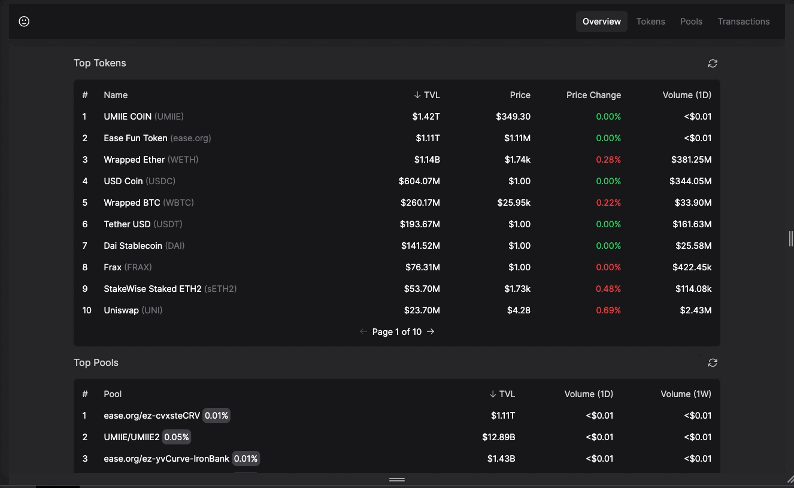
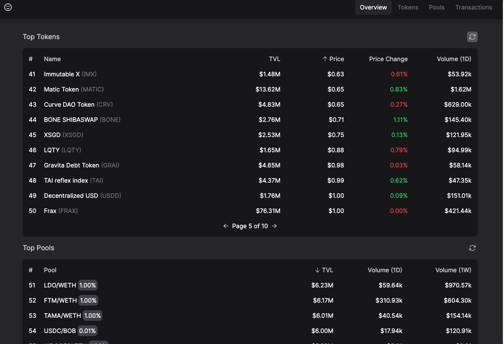
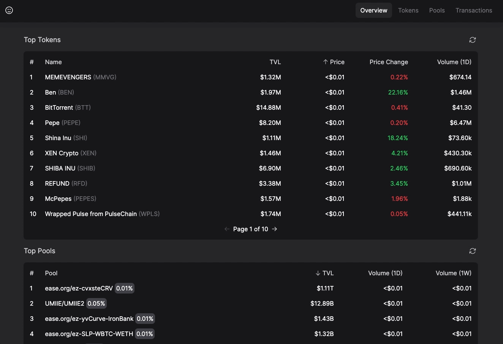
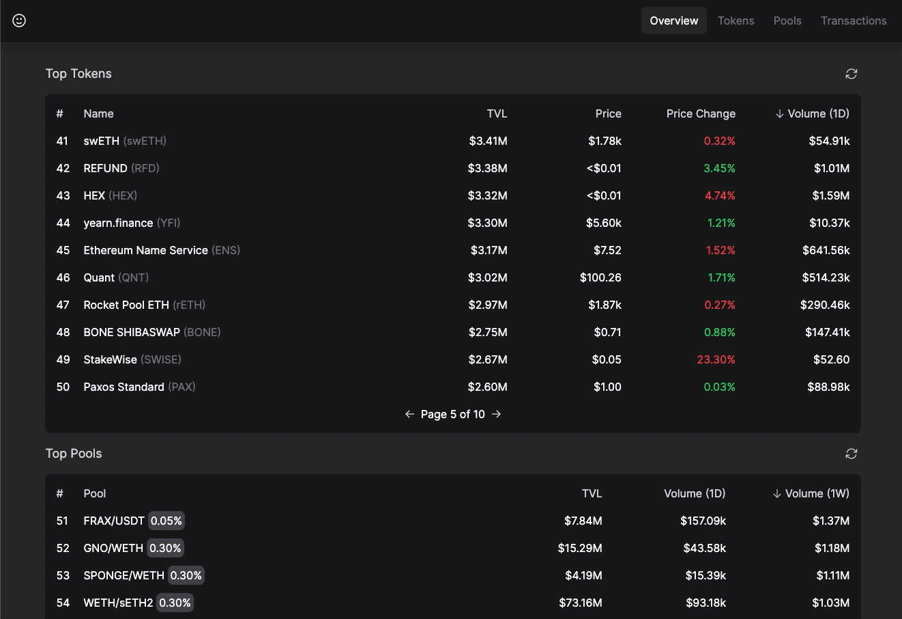
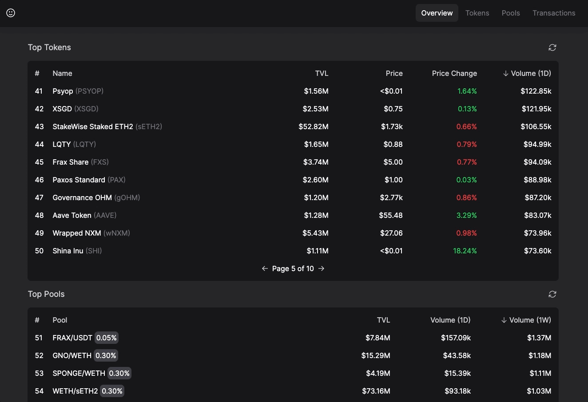
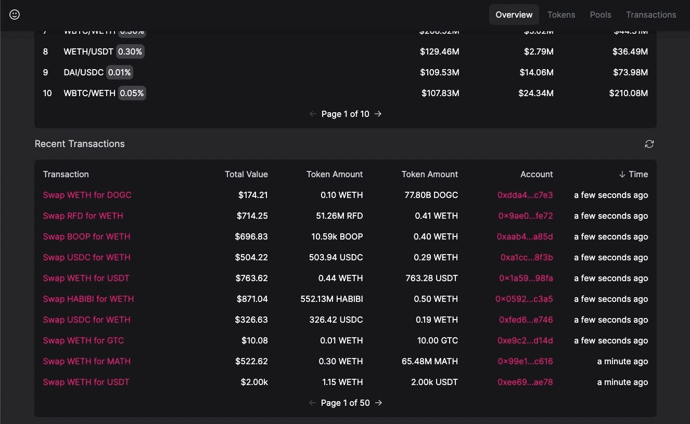

<p align="center">
    
</p>

## Overview

The Uniswap Data Explorer is a responsive React application designed to query and display data from the Uniswap subgraph v3. This powerful tool provides valuable insights into the Uniswap ecosystem by showcasing information about the top tokens, pools, and most recent transactions in both tabular and graphical formats.

## Technology

- 
- 
- 
- 

## Features

- Responsive Design
<p align="center">
    
</p>

- Sorting Functionality
<p align="center">
    
</p>

- Pagination
<p align="center">
    
</p>

- Graphical Formats
<p align="center">
    
</p>

- Refresh Capabilitiy
<p align="center">
    
</p>

- Link Transactions to Etherscan
<p align="center">
    
</p>

## Getting Started

### Prerequisites

- yarn/npm

### Installation

```sh
git clone https://github.com/klam2k20/UniswapInfo.git

cd frontend

# Install dependencies
npm install

# Start the application
npm run start
```
